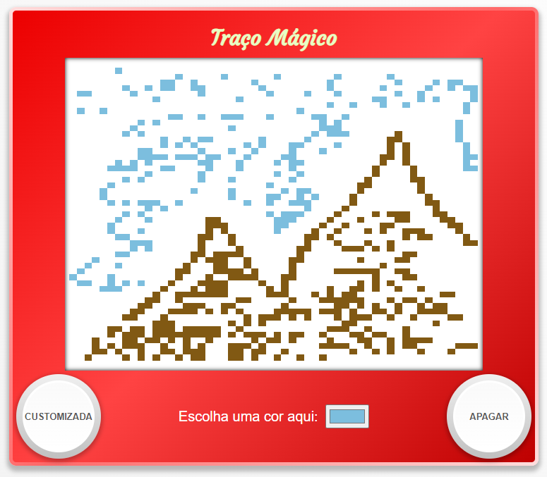

#Traço Mágico

Este é um projeto que imita o brinquedo de criação de desenhos "Etch A Sketch" (conhecido como Traço Mágico no Brasil). O projeto foi proposto pelo site [The Odin Project](https://www.theodinproject.com) para aprendizado dos fundamentos de JavaScript e manipulação do DOM. O projeto pode ser acessado no link [diego-moreira8.github.io/odin-etch-a-sketch](https://diego-moreira8.github.io/odin-etch-a-sketch).

